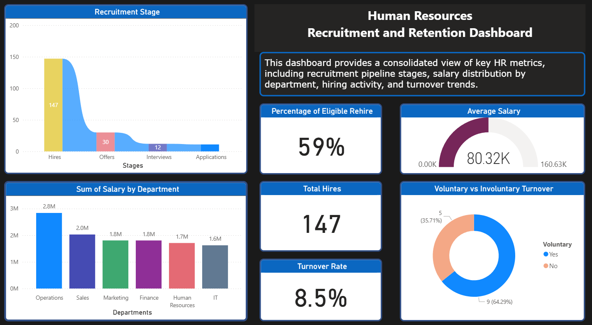
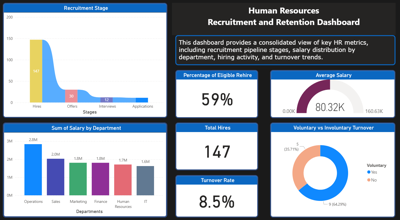

# 💼 Human Resources Analytics Dashboard
## 📌 Project Overview
This project showcases an interactive Human Resources Analytics Dashboard built in Power BI. The dashboard consolidates key workforce insights into one view, empowering HR teams and executives to make data-driven decisions around recruitment, compensation, and retention.
## 🔎 Key Features
-	**Recruitment Stages** - visualize the hiring pipeline from application through hire
-	**Salary Insights** – sum of salary by department and average salary benchmarking
-	**Turnover Analysis** – overall turnover rate, voluntary vs. involuntary exits, and % eligible for rehire
-	**Workforce Metrics** – total hires, department-level salary insights, and employee retention indicators
## 🛠️ Tools & Techniques
-	Power BI for data modeling and visualization
-	Power Query for data cleaning and transformation
-	DAX for calculated measures (turnover %, average days to hire, rehire eligibility %)
-	Excel for initial data exploration
-	GitHub for portfolio documentation and sharing
## 🎯 Purpose
To demonstrate how HR data can be transformed into actionable insights through interactive dashboards, highlighting the value of analytics in improving hiring efficiency, understanding workforce trends, and supporting people-focused decision-making.

## 📎 Files Included

- `Human_Resources_Dashboard.pbix` — Power BI dashboard file  
- `hr_sample_data.csv` — Sample or anonymized dataset  
- `hr_dashboard.png` — image
- `hr_dash_video.mp4` – Dashboard Video  
- `README.md` — Project documentation (this file)

📊 Sample Visuals
(Insert screenshots of your Power BI dashboard here — e.g., Recruitment Funnel, Salary Benchmark, Turnover KPIs.)

## 📊 Sample Visuals

## 📊 Sample Video Demonstration

*Tip: Right-click and choose “Open link in new tab” to keep browsing this repo while watching the video.*

## 🗂️ Project Status

✅ Complete – Ready for demonstration and portfolio inclusion  

## 📫 Contact
Catherine McKillips

[LinkedIn](https://www.linkedin.com/in/catherine-mckillips-data-analytics)  

## 📧 Email
cathymckillips@gmail.com
